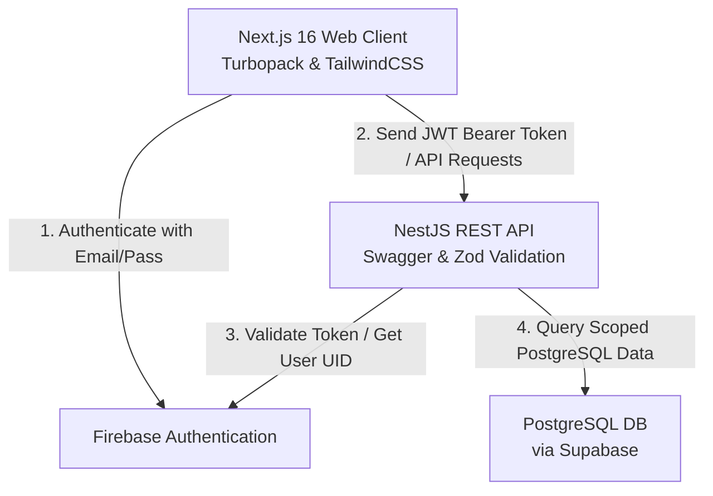
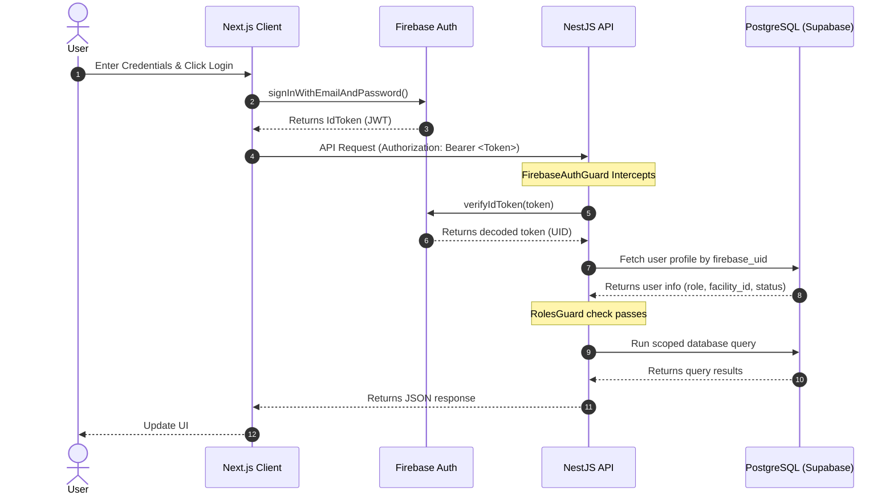
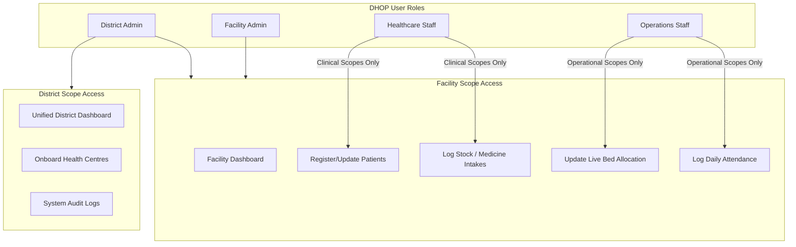

# 🩺 DHOP — District Health Operations Platform

DHOP is a state-of-the-art, centralized operational hub designed to digitize, monitor, and streamline the daily operations of multiple health centres (Primary Health Centres (PHCs), Community Health Centres (CHCs), and District Hospitals) across a district.

---

## 💡 Our Solution

DHOP addresses operational bottlenecks in public healthcare delivery through four core pillars:

1. **📝 Single Digital Register**: Replaces fragmented manual paper logs with a unified, digital registry for patient admissions (OPD/IPD), beds, medicine inventory, and staff rosters.
2. **⚡ Real-Time Dashboards**: Provides instant visibility into current ward vacancy, bed occupancy statuses, and low-stock warning thresholds.
3. **📈 Telemetry & Statistical Analysis**: Equips both district admins and facility managers with interactive trend analysis (e.g., patient registration trends, bed utilization percentages, medicine shortage audits, and staff attendance tracking).
4. **📊 Automated Data Compilation**: Generates instant operational KPI summaries and periodic reports exportable to printable formats or raw CSV files.

---

## 🌟 Core Features & Capability Overview

DHOP replaces manual paper registers, phone coordination, and disjointed spreadsheets with real-time operational visibility for district health administrators and facility managers:

*   **📦 Medicine Inventory**: Monitor active stock levels, flag low-stock thresholds, record batch numbers, track expiry dates, and manage intakes.
*   **🛌 Bed Availability**: Live tracking of bed occupancy statuses across general, ICU, and specialized wards.
*   **📅 Staff Attendance**: Log daily check-in/out records for clinicians, nurses, and operations staff.
*   **👥 Patient Admissions**: Digital patient registers for OPD/IPD visits, recording demographic categories, diagnoses, and attending doctors.
*   **📊 Reports Compilation**: Generate dynamic, periodic analytics sheets and export records to printable formats and CSV files.
*   **🔒 Security & Audits**: Action logging of all mutations in the database, with robust role-based access control.

---

## 🏗️ Architecture & Authentication Flow

### High-Level Architecture



### Request Authentication Sequence

This sequence diagram outlines how the client handles secure request cycles utilizing **Firebase authentication JWTs** and **NestJS guards**:



---

## 👥 User Roles, Scopes & Data Isolation

DHOP implements strict data isolation between facilities to prevent cross-facility leaks while allowing district admins to overview the entire district:

1.  **District Scope (District Admin)**: Cross-facility query scopes to view, compare, and audit all facilities across the entire district.
2.  **Facility Scope (Facility Admin, Staff)**: Read and write queries are strictly limited to the specific health centre (`facilityId`) assigned to their profile.



### Module Permissions Matrix

| Functional Module | Operations | District Admin (`DISTRICT_ADMIN`) | Facility Admin (`FACILITY_ADMIN`) | Healthcare Staff (`HEALTHCARE_STAFF`) | Operations Staff (`OPERATIONS_STAFF`) |
| :--- | :--- | :---: | :---: | :---: | :---: |
| **Dashboard** | View Aggregated District KPIs | **🟢 YES** | 🔴 NO | 🔴 NO | 🔴 NO |
| | View Local Facility Metrics | **🟢 YES** | **🟢 YES** | **🟢 YES** | **🟢 YES** |
| **Health Centres** | Create / Edit Health Centres | **🟢 YES** (Exclusive) | 🔴 NO | 🔴 NO | 🔴 NO |
| **Patients** | View / Register Patient Records | **🟢 YES** (District-wide) | **🟢 YES** | **🟢 YES** | 🔴 NO |
| **Medicines** | Adjust stock & intakes | **🟢 YES** (View-only) | **🟢 YES** | **🟢 YES** | 🔴 NO |
| **Beds** | Assign Ward Beds / Occupancy | 🔴 NO | **🟢 YES** | 🔴 NO | **🟢 YES** |
| **Attendance** | Check-In / Check-Out Shift | 🔴 NO | **🟢 YES** | 🔴 NO | **🟢 YES** |
| **Reports** | Compile & Generate PDF Reports | **🟢 YES** | **🟢 YES** | 🔴 NO | 🔴 NO |
| **Users** | Register / Modify Accounts | **🟢 YES** (Exclusive) | 🔴 NO | 🔴 NO | 🔴 NO |
| **Audit Logs** | View System Operation History | **🟢 YES** (Exclusive) | 🔴 NO | 🔴 NO | 🔴 NO |

---

## 🛠️ Codebase Structure

Key source components in the directory structure are clickable below:

*   **`backend/`**: NestJS REST API codebase.
    *   [`main.ts`](file:///c:/Users/lenov/OneDrive/Desktop/HARSHIT/build%20with%20ai/CureSync/backend/src/main.ts) — App entry point, Swagger docs registration, and global prefix setup.
    *   [`src/common/guards/`](file:///c:/Users/lenov/OneDrive/Desktop/HARSHIT/build%20with%20ai/CureSync/backend/src/common/guards/) — Security layer including [`firebase-auth.guard.ts`](file:///c:/Users/lenov/OneDrive/Desktop/HARSHIT/build%20with%20ai/CureSync/backend/src/common/guards/firebase-auth.guard.ts) and the RBAC guard.
    *   [`src/database/seeds/`](file:///c:/Users/lenov/OneDrive/Desktop/HARSHIT/build%20with%20ai/CureSync/backend/src/database/seeds/) — Seeding scripts including the Firebase login populator [`create-firebase-users.js`](file:///c:/Users/lenov/OneDrive/Desktop/HARSHIT/build%20with%20ai/CureSync/backend/src/database/seeds/create-firebase-users.js).
*   **`frontend/`**: Next.js client-side interface.
    *   [`components/dhop/`](file:///c:/Users/lenov/OneDrive/Desktop/HARSHIT/build%20with%20ai/CureSync/frontend/components/dhop/) — Reusable layouts: [`app-shell.tsx`](file:///c:/Users/lenov/OneDrive/Desktop/HARSHIT/build%20with%20ai/CureSync/frontend/components/dhop/app-shell.tsx), `sidebar.tsx`, etc.
    *   [`app/(auth)/login/`](file:///c:/Users/lenov/OneDrive/Desktop/HARSHIT/build%20with%20ai/CureSync/frontend/app/(auth)/login/) — Authentication login page with credential autofills.
    *   [`app/(dashboard)/reports/`](file:///c:/Users/lenov/OneDrive/Desktop/HARSHIT/build%20with%20ai/CureSync/frontend/app/(dashboard)/reports/) — Reports page featuring CSV/PDF compilation.
*   **`database/`**: PostgreSQL schemas.
    *   [`schema.sql`](file:///c:/Users/lenov/OneDrive/Desktop/HARSHIT/build%20with%20ai/CureSync/database/schema.sql) — Core database structure definition.
    *   [`seed.sql`](file:///c:/Users/lenov/OneDrive/Desktop/HARSHIT/build%20with%20ai/CureSync/database/seed.sql) — Mock district facilities, patient records, and inventories.

---

## 🚀 Local Installation & Execution Guide

### Prerequisites
Make sure you have [Node.js](https://nodejs.org/) (v18+ recommended) and `npm` installed.

### 1. Running the Backend (NestJS)
1.  Navigate to the backend directory:
    ```bash
    cd backend
    ```
2.  Install dependencies:
    ```bash
    npm install
    ```
3.  Configure your variables in `.env` (refer to `.env.example`).
4.  Start the NestJS development server in watch mode:
    ```bash
    npm run start:dev
    ```
    The server will boot on port `8081` by default. Swagger documentation will be available at [http://localhost:8081/api/v1/docs](http://localhost:8081/api/v1/docs).

### 2. Updating Firebase Auth Seed (Optional)
If you need to seed or update the demo credentials on your Firebase project:
```bash
node src/database/seeds/create-firebase-users.js
```

### 3. Running the Frontend (Next.js)
1.  Open a new terminal and navigate to the frontend directory:
    ```bash
    cd frontend
    ```
2.  Install dependencies:
    ```bash
    npm install
    ```
3.  Configure Firebase values inside `.env.local`.
4.  Boot the Next.js development server (Turbopack):
    ```bash
    npm run dev
    ```
    Access the interactive web portal at [http://localhost:3000](http://localhost:3000).
